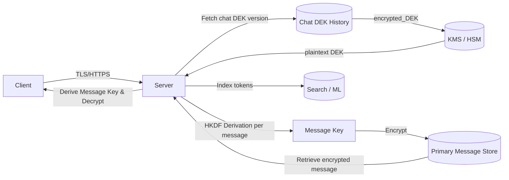

# Non-End-to-End Encrypted Chat — Implementation Guide

This document provides a complete blueprint for implementing a non-end-to-end encrypted chat system with per-message encryption. It covers message flow, key management, database schema, algorithms, operational requirements, and a visual diagram.

---

## 1️⃣ Message Flow

### Sending a message

1. Client sends a plaintext message to the server over **TLS/HTTPS or WSS**.
2. Server retrieves **chat DEK** (encrypted) from metadata DB (Postgres).
3. Server calls **KMS `Decrypt`** to get plaintext DEK.
4. **Derive message key** from chat DEK using **HKDF / KDF**:

   ```text
   message_key = HKDF(chat_DEK, message_id || optional_nonce)
   ```
5. Encrypt the message using `message_key` (AES-256-GCM or other AEAD).
6. Store **encrypted message** + **DEK version** in primary DB (Cassandra / Scylla).
7. Index plaintext message (tokens) in **Elasticsearch/OpenSearch** for search/ML purposes.

### Reading a message

1. Retrieve message ciphertext + DEK version from primary DB.
2. Retrieve chat’s encrypted DEK (Postgres) corresponding to DEK version.
3. Call **KMS `Decrypt`** → get plaintext chat DEK.
4. Derive `message_key` using same KDF + message\_id.
5. Decrypt message and send back to client over TLS.

---

## 2️⃣ Key Management (HashiCorp Vault)

| Concept                  | Description                                                                                                                                     |
| ------------------------ | ----------------------------------------------------------------------------------------------------------------------------------------------- |
| **CMK (KMS Master Key)** | Root key stored in KMS/HSM; can rotate automatically.                                                                                           |
| **Chat DEK**             | Generated per chat using KMS `GenerateDataKey`; stored encrypted in Postgres; used as root for per-message keys.                                |
| **Per-message key**      | Derived deterministically from chat DEK + message\_id via HKDF; used to encrypt/decrypt individual messages; **not stored**, derived on demand. |
| **DEK version**          | Tracks rotation of chat DEKs; stored with messages to know which DEK to use for decryption.                                                     |

**Notes:**

* Only **chat DEKs** are stored; per-message keys are **derived dynamically**.
* KMS calls are minimized → only per chat, not per message.
* Rotation of chat DEK requires storing multiple DEK versions for historical messages.

---

## 3️⃣ Database / Storage Schema

### Postgres — Chat Metadata Table

| Column       | Type          | Purpose                           |
| ------------ | ------------- | --------------------------------- |
| chat\_id     | UUID / BIGINT | Unique chat identifier            |
| participants | JSON / array  | Users in chat                     |
| created\_at  | TIMESTAMP     | Creation timestamp                |
| updated\_at  | TIMESTAMP     | Last rotation or update timestamp |

### Postgres — Chat DEK History Table

| Column         | Type          | Purpose                                      |
| -------------- | ------------- | -------------------------------------------- |
| id             | UUID / BIGINT | Unique record ID                             |
| chat\_id       | UUID / BIGINT | Foreign key to chat metadata table           |
| encrypted\_DEK | BYTEA / TEXT  | DEK encrypted by KMS CMK                     |
| DEK\_version   | INT           | Version of the chat DEK                      |
| valid\_from    | TIMESTAMP     | Optional start date for DEK version validity |
| valid\_to      | TIMESTAMP     | Optional end date for DEK version validity   |
| created\_at    | TIMESTAMP     | Record creation timestamp                    |

### Primary Message Store (Cassandra / Scylla)

| Column             | Type          | Purpose                                    |
| ------------------ | ------------- | ------------------------------------------ |
| message\_id        | UUID / BIGINT | Unique message identifier                  |
| chat\_id           | UUID / BIGINT | Reference to chat                          |
| encrypted\_message | BYTEA / TEXT  | Message encrypted with derived message key |
| DEK\_version       | INT           | DEK version used for derivation            |
| created\_at        | TIMESTAMP     | Message timestamp                          |

### Search Index (Elasticsearch / OpenSearch)

| Field         | Purpose                                                    |
| ------------- | ---------------------------------------------------------- |
| message\_id   | Reference to primary DB                                    |
| chat\_id      | For filtering / query                                      |
| tokens / text | Plaintext tokens extracted for search / similarity queries |
| metadata      | Optional info like sender, timestamp                       |

---

## 4️⃣ Encryption & Algorithmic Requirements

| Requirement            | Recommendation                                                              |
| ---------------------- | --------------------------------------------------------------------------- |
| Symmetric encryption   | AES-256-GCM (AEAD)                                                          |
| Key derivation         | HKDF or PBKDF2 from chat DEK + message\_id                                  |
| Message authentication | Use AEAD mode (AES-GCM) or HMAC with AES-CBC                                |
| KMS wrapping           | Chat DEK encrypted with CMK in KMS                                          |
| Transport encryption   | TLS/HTTPS or WSS                                                            |
| Caching                | In-memory cache (Redis / local) for decrypted chat DEKs to reduce KMS calls |

---

## 5️⃣ Security & Operational Considerations

1. **Compromise scenarios**

   * Postgres leak → attackers see **only encrypted DEKs** → cannot decrypt messages without KMS.
   * Primary DB leak → messages encrypted, cannot be read without chat DEKs.
   * KMS + Postgres compromise → full access to messages.

2. **Rotation**

   * CMK rotation is transparent in KMS.
   * Chat DEK rotation stored as a **history table**; old versions kept for decrypting historical messages.
   * Each message references DEK version used.

3. **Message deletion / retention**

   * If messages are deleted, can also delete associated DEK version if no messages rely on it.

4. **Search / ML**

   * Only plaintext tokens stored in search engine.
   * Search engine cannot decrypt full messages — reduces exposure in case of breach.

5. **Performance**

   * Message key derivation is cheap (HKDF).
   * KMS calls minimized per chat.
   * Caching chat DEKs in memory improves throughput.

---

## 6️⃣ Optional Enhancements

* Per-message nonces in HKDF for stronger forward secrecy.
* Multi-tenant / region-specific DEKs.
* Batch key rotation for active chats.
* Encrypt attachments using the same chat DEK, derived per file ID.

---

## 7️⃣ Diagram



This diagram shows the flow: client sends a message over TLS, server fetches encrypted chat DEK from Postgres history table, decrypts via KMS, derives per-message key, encrypts message, stores in primary DB, indexes tokens for search, and then decrypts on retrieval.

---

**This markdown file serves as a reference implementation for a non-end-to-end encrypted chat system with per-message encryption, including DEK version history management.**
